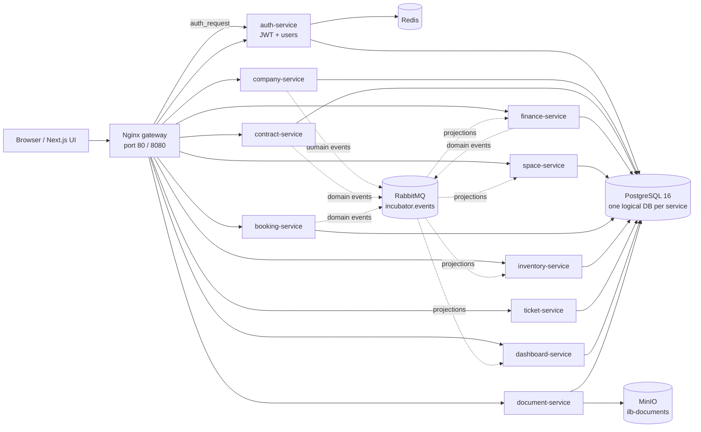

# IncubatorManager — ILB Incubator Management Platform

IncubatorManager is a full-stack management platform for the ILB incubator
(**Incubadora de Lanheses e Bertiandos**). It models the daily operations of an
incubator: companies, users, contracts, payments, spaces, bookings, inventory,
support tickets, documents, dashboards, public booking requests, and role-based
staff/client workflows.

The repository is a Docker Compose-first monorepo built as a strict
microservices system: each business context is a separately deployable Django
REST service with its own database schema, all browser and API traffic enters
through an Nginx gateway, asynchronous integrations use RabbitMQ domain events,
and the frontend is a Next.js 14 application served behind the same gateway.

> **Current repository:** `git@github.com:joaojhgs/incubatormanager.git`  
> **Default branch:** `main`  
> **Timezone:** `Europe/Lisbon`

---

## Table of contents

- [What the platform does](#what-the-platform-does)
- [Feature overview](#feature-overview)
- [Architecture at a glance](#architecture-at-a-glance)
- [Technology stack](#technology-stack)
- [Repository layout](#repository-layout)
- [Quick start](#quick-start)
- [Development workflows](#development-workflows)
- [Tilt live-development workflow](#tilt-live-development-workflow)
- [Demo data and local credentials](#demo-data-and-local-credentials)
- [Testing and verification](#testing-and-verification)
- [Feature screenshots](#feature-screenshots)
- [Technical report and supporting docs](#technical-report-and-supporting-docs)
- [CI/CD and deployment](#cicd-and-deployment)
- [Security and operational notes](#security-and-operational-notes)
- [Contributing](#contributing)

---

## What the platform does

IncubatorManager provides a single operational interface for incubator staff and
self-service access for incubated companies.

- **Staff/director users** manage companies, platform users, contracts, spaces,
  bookings, inventory, support tickets, finance records, documents, and service
  dashboards.
- **Client users** see only their company-scoped portal: company profile,
  contract state, payments, bookings, and support tickets.
- **Public visitors** can submit booking requests without authenticating.
- **Operators/developers** can run the full production-shaped stack locally with
  Docker Compose, or use Tilt for live development.

The implementation favours clear service boundaries over a shared monolith: data
ownership is local to each service, cross-service references are UUIDs, and
read-model/projection updates happen through RabbitMQ events or explicit REST
calls.

---

## Feature overview

### Authentication and authorization

- JWT login, refresh, logout, and token validation in `auth-service`.
- Gateway-level `auth_request` validation in Nginx.
- Trusted identity headers forwarded to downstream services:
  - `X-User-Id`
  - `X-User-Role`
  - `X-Company-Id`
- Role-aware frontend route guards and post-login redirects.
- Client isolation based on the authenticated `company_id` claim.
- Refresh-token blacklist, logout revocation, and login/rate-limit cache support
  through Redis when configured.

### Staff portal

Routes live under the Next.js staff route group in `frontend/app/(staff)/`.

| Area      | Route                                             | Purpose                                                                                  |
| --------- | ------------------------------------------------- | ---------------------------------------------------------------------------------------- |
| Dashboard | `/dashboard`                                      | Operational overview, service health, business counters, and drill-through actions.      |
| Companies | `/companies`, `/companies/new`, `/companies/[id]` | Company lifecycle, CAE/maturity/status data, employees, archive state, linked documents. |
| Users     | `/users`, `/users/new`                            | Platform user creation and staff/client account management.                              |
| Contracts | `/contracts`                                      | Company/space contracts, activation, termination, expiration, and commercial state.      |
| Finance   | `/finance`                                        | Payments, billing rows, totals, pending/overdue records, and finance summaries.          |
| Spaces    | `/spaces`                                         | Physical incubator spaces, capacity, status, pricing, and occupancy.                     |
| Bookings  | `/bookings`                                       | Staff review and lifecycle handling for authenticated/public booking requests.           |
| Inventory | `/inventory`                                      | Equipment types, equipment status, booking/space projections, and assignment history.    |
| Tickets   | `/tickets`                                        | Client support queue, ticket statuses, and ticket metrics for dashboards.                |

### Client portal

Routes live under `frontend/app/(client)/portal/`.

| Area     | Route              | Purpose                                                                       |
| -------- | ------------------ | ----------------------------------------------------------------------------- |
| Overview | `/portal`          | Company-scoped summary of profile, contract, payments, bookings, and tickets. |
| Company  | `/portal/company`  | Authenticated client's company profile.                                       |
| Contract | `/portal/contract` | Active/recent company contracts.                                              |
| Payments | `/portal/payments` | Company-scoped finance records.                                               |
| Bookings | `/portal/bookings` | Company booking history and submission flows where enabled.                   |
| Tickets  | `/portal/tickets`  | Client support requests and follow-up.                                        |

If a client account has no company association, the portal should show a
support/no-company state rather than leaking another company's data.

### Public booking request

- `/booking-request` is intentionally unauthenticated.
- Public routes are whitelisted in `gateway/nginx.conf`:
  - `/api/bookings/external`
  - `/api/bookings/public-calendar`
  - `/api/public/spaces/`
  - `/api/public/inventory/equipment/`
- Staff can review requests through the booking workflow when seed data and the
  local stack are available.

### Documents

- `document-service` stores document metadata in its own database.
- MinIO provides S3-compatible object storage.
- Frontend document components live in `frontend/components/documents/`.
- Gateway upload limit is configured in Nginx (`client_max_body_size 50m`).

### Dashboards and reporting

- `dashboard-service` owns dashboard read models and service-health snapshots.
- Dashboard aggregation reads service metric endpoints instead of deriving KPIs
  from full list payloads.
- Ticket counters are exposed at `/api/tickets/metrics/` for staff dashboard
  aggregation.

---

## Architecture at a glance



### Service catalogue

| Service             | Port | Gateway prefix    | Database       | Responsibility                                                               |
| ------------------- | ---: | ----------------- | -------------- | ---------------------------------------------------------------------------- |
| `auth-service`      | 8001 | `/api/auth/`      | `auth_db`      | Users, JWT login/refresh/logout, token validation, role/company claims.      |
| `company-service`   | 8002 | `/api/companies/` | `company_db`   | Companies, CAE, maturity stages, company profiles, employees, archive state. |
| `contract-service`  | 8003 | `/api/contracts/` | `contract_db`  | Contracts, activation, termination, expiration, contract events.             |
| `finance-service`   | 8004 | `/api/finance/`   | `finance_db`   | Billing, payments, charges, finance dashboards, overdue handling.            |
| `space-service`     | 8005 | `/api/spaces/`    | `space_db`     | Space types, spaces, prices, capacity, availability, occupancy projections.  |
| `booking-service`   | 8006 | `/api/bookings/`  | `booking_db`   | Authenticated and public bookings, calendar, availability, booking events.   |
| `inventory-service` | 8007 | `/api/inventory/` | `inventory_db` | Equipment types, equipment, assignment history, event projections.           |
| `ticket-service`    | 8008 | `/api/tickets/`   | `ticket_db`    | Client support tickets, staff queue, messages, status, ticket metrics.       |
| `dashboard-service` | 8009 | `/api/dashboard/` | `dashboard_db` | Staff dashboard read models, service health, aggregate endpoints.            |
| `document-service`  | 8010 | `/api/documents/` | `document_db`  | Document metadata and MinIO-backed upload/download flows.                    |

Backend ports are internal to the Docker network. External traffic goes through
the gateway; the frontend is served on `/` and APIs on `/api/...`.

### Integration model

- **Synchronous REST** is used for request/response workflows that must complete
  during a user action.
- **RabbitMQ domain events** update projections and eventually consistent views.
- **Shared Python library** `libs/py-common` contains event-bus, auth-header, and
  bootstrap helpers used by services.
- **No shared ORM models** are used between services.
- **Scheduler sidecars** run management commands through cron definitions in
  `infra/cron/`; Celery is intentionally not used.

### Domain events

RabbitMQ topic exchange: `incubator.events`.

Every message uses the shared envelope:

```json
{
  "event_id": "uuid",
  "event_type": "booking.approved",
  "occurred_at": "2026-06-02T16:27:04Z",
  "payload": {}
}
```

Current event catalogue includes:

- `company.created`
- `company.archived`
- `employee.changed`
- `contract.activated`
- `contract.terminated`
- `contract.expired`
- `booking.approved`
- `booking.rejected`
- `booking.cancelled`
- `booking.completed`
- `payment.recorded`

Consumers must be idempotent on `event_id`. See
[`docs/events.md`](docs/events.md) for payload expectations.

---

## Technology stack

### Backend

- Python 3.12
- Django 5
- Django REST Framework
- PostgreSQL 16
- Redis 7
- RabbitMQ 3.13 topic exchange
- MinIO S3-compatible object storage
- Ruff and pytest for quality checks

### Frontend

- Node 20
- Next.js 14 App Router
- React 18
- TypeScript
- Ant Design v5
- React Query
- Axios
- Day.js
- JOSE/JWT helpers
- Vitest and Playwright

### Platform and tooling

- Docker Compose v2
- Tilt live-development orchestration
- Nginx gateway with `auth_request`
- Makefile-driven local workflows
- GitHub-hosted repository after migration from the original GitLab remote
- Existing GitLab CI configuration remains in `.gitlab-ci.yml` for the original
  course deployment pipeline documentation/history

---

## Repository layout

```text
.
├── frontend/                 # Next.js App Router frontend
├── gateway/                  # Nginx reverse proxy and auth_request config
├── services/                 # Django microservices, one bounded context each
│   ├── auth-service/
│   ├── booking-service/
│   ├── company-service/
│   ├── contract-service/
│   ├── dashboard-service/
│   ├── document-service/
│   ├── finance-service/
│   ├── inventory-service/
│   ├── space-service/
│   └── ticket-service/
├── libs/py-common/           # Shared Python service utilities
├── infra/
│   ├── cron/                 # Scheduler sidecar crontabs
│   ├── docker/               # Postgres/RabbitMQ config and init scripts
│   ├── scripts/              # Cron runner, MinIO init, helper scripts
│   ├── seed/                 # Deterministic local demo seed data
│   ├── docker-compose.yml    # Main production-shaped local topology
│   ├── docker-compose.dev.yml
│   └── Tiltfile              # Tilt resource definitions
├── docs/                     # Architecture, deployment, user, report, defense docs
├── docs/final-report/        # Final LaTeX report source and compiled PDF
├── e2e/                      # Gateway/browser smoke tests
├── scripts/                  # Root helper scripts
├── Makefile                  # Developer commands and verification targets
├── package.json              # Root JS lint/format/e2e tooling
├── pyproject.toml            # Ruff config
├── Tiltfile                  # Root Tilt entrypoint including infra/Tiltfile
└── README.md
```

---

## Quick start

### Prerequisites

- Docker Engine with Docker Compose v2
- Tilt, optional but recommended for live development
- Python 3.12 (`.python-version`)
- Node.js 20 (`.nvmrc`)
- `make`

### Clone and configure

```bash
git clone git@github.com:joaojhgs/incubatormanager.git
cd incubatormanager
cp .env.example .env
```

For local development, `.env.example` is enough to start after copying. For a
real deployment, change all placeholder secrets and passwords.

Important environment values:

| Variable                                 | Purpose                                                                    |
| ---------------------------------------- | -------------------------------------------------------------------------- |
| `POSTGRES_PASSWORD`                      | PostgreSQL superuser password for local compose.                           |
| `*_DB_PASSWORD`                          | Per-service database passwords created by the Postgres init script.        |
| `DJANGO_SECRET_KEY`                      | Django signing secret. Must be replaced outside local demos.               |
| `AUTH_JWT_SECRET`                        | HS256 JWT signing key. `scripts/generate-env.sh` can generate one.         |
| `AUTH_DEV_SEED_PASSWORD`                 | Shared password for seeded local demo users unless role overrides are set. |
| `MINIO_ROOT_USER`, `MINIO_ROOT_PASSWORD` | Local MinIO credentials.                                                   |
| `NEXT_PUBLIC_API_URL`                    | Browser API base URL; default `/api` for same-origin gateway calls.        |

Generate a fresh local `.env` with random secrets:

```bash
make env
```

### Start the stack

```bash
make up
```

Open:

- Frontend: <http://localhost/>
- Gateway health: <http://localhost/health>
- API example: <http://localhost/api/auth/health>

Inspect runtime state:

```bash
make ps
make logs
```

Stop the stack:

```bash
make down
```

---

## Development workflows

### Common Make targets

```bash
make help              # list available targets
make up                # production-shaped compose stack
make up-dev            # compose stack with dev overrides
make down              # stop containers
make logs              # tail logs
make ps                # show compose service status
make build             # build all service images
make rebuild           # no-cache rebuild
make seed              # load deterministic local seed data
make demo              # reset volumes, start, seed, and tail logs
make lint              # ruff + ESLint + Prettier checks
make format            # apply Ruff and Prettier formatters
make local-gate-host   # host-side lint/type/test/build gate
```

### Frontend development

```bash
npm --prefix frontend ci
npm --prefix frontend run dev
npm --prefix frontend run typecheck
npm --prefix frontend test
npm --prefix frontend run build
```

The frontend uses:

- `frontend/app/` for route groups and pages
- `frontend/components/` for feature/shared components
- `frontend/lib/api/` for API clients
- `frontend/lib/auth/` for session, route, and JWT helpers
- `frontend/lib/i18n/` for user-facing dictionaries
- `frontend/lib/query/` for React Query wiring

### Backend development

Each service is independently runnable/testable from its service directory, but
most local work is easiest through Compose or Make targets.

```bash
make test-backend-host     # run migration checks and pytest for all services locally
make test-backend          # run pytest in service containers
make test-libs             # test libs/py-common
```

For a single service:

```bash
cd services/auth-service
python3 manage.py makemigrations --check --dry-run
python3 -m pytest -q
```

---

## Tilt live-development workflow

Tilt is configured for faster feedback while preserving the same service
boundaries as Docker Compose.

Run from the repository root:

```bash
tilt up
```

The root `Tiltfile` includes `infra/Tiltfile`, which loads:

- `docker-compose.tilt.yml`
- `infra/docker-compose.yml`
- `infra/docker-compose.dev.yml`
- `infra/docker-compose.apparmor.yml`
- `infra/docker-compose.tilt-health.yml`

Tilt resource groups:

- **infra:** Postgres, Redis, RabbitMQ, MinIO, MinIO init, gateway
- **backend:** Django services, consumers, and scheduler sidecars
- **frontend:** Next.js frontend
- **manual local resource:** `seed`

The Tiltfile scopes Docker build watches so editing one service does not rebuild
the whole monorepo. Backend images watch their service directory plus
`libs/py-common`; the frontend watches `frontend/`; the gateway watches
`gateway/`.

Manual seed from Tilt UI or shell:

```bash
tilt trigger seed
```

If your host cannot read AppArmor profiles or execute healthcheck probes because
of sandbox restrictions, the included AppArmor/Tilt health compose overlays are
intended to keep local development usable.

---

## Demo data and local credentials

Demo users are created by `auth-service` through:

```bash
make seed
```

The seed command uses:

- `AUTH_DEV_SEED_PASSWORD` as the default password for all seeded users
- optional role-specific overrides:
  - `AUTH_DEV_SEED_DIRECTOR_PASSWORD`
  - `AUTH_DEV_SEED_STAFF_PASSWORD`
  - `AUTH_DEV_SEED_CLIENT_PASSWORD`

Do not commit real credentials. Keep actual demo passwords in `.env` or private
operator notes.

Recommended demo path:

```bash
make demo
# in another terminal after services are healthy:
make seed
NODE_PATH="$PWD/frontend/node_modules" frontend/node_modules/.bin/playwright test -c e2e/playwright.config.ts
```

See [`docs/defense/demo-script.md`](docs/defense/demo-script.md) and
[`docs/user.md`](docs/user.md) for walkthrough steps.

---

## Testing and verification

### Full host-side gate

```bash
make local-gate-host
```

This runs:

- Ruff checks
- root ESLint and frontend ESLint
- Prettier check
- frontend TypeScript check
- frontend Vitest suite
- frontend production build
- cron runner syntax/dry-run checks
- `infra/tests`
- `libs/py-common` tests
- backend migration checks and pytest for each Django service

### Focused checks

```bash
ruff check .
npm run lint
npm run format:check
npm --prefix frontend run typecheck
npm --prefix frontend test
npm --prefix frontend run build
python3 -m pytest infra/tests
make test-libs
make test-backend-host
```

### Docker-backed checks

```bash
make up
make seed
make test-backend
NODE_PATH="$PWD/frontend/node_modules" frontend/node_modules/.bin/playwright test -c e2e/playwright.config.ts
```

Docker socket failures are environment blockers, not product failures. Record
such blockers in the QA/defense docs rather than claiming a passing product
check.

---

## Feature screenshots

No product screenshots are currently committed outside dependency folders. The
README therefore does not embed stale or fabricated images.

When capturing screenshots for GitHub or the final defense package, store them
under `docs/screenshots/` and update this table with real image links:

| Feature                  | Suggested path                         | Route to capture       |
| ------------------------ | -------------------------------------- | ---------------------- |
| Login                    | `docs/screenshots/login.png`           | `/login`               |
| Staff dashboard          | `docs/screenshots/staff-dashboard.png` | `/dashboard`           |
| Companies                | `docs/screenshots/companies.png`       | `/companies`           |
| Company detail/documents | `docs/screenshots/company-detail.png`  | `/companies/[id]`      |
| Contracts                | `docs/screenshots/contracts.png`       | `/contracts`           |
| Finance                  | `docs/screenshots/finance.png`         | `/finance`             |
| Spaces and bookings      | `docs/screenshots/spaces-bookings.png` | `/spaces`, `/bookings` |
| Inventory                | `docs/screenshots/inventory.png`       | `/inventory`           |
| Tickets                  | `docs/screenshots/tickets.png`         | `/tickets`             |
| Client portal            | `docs/screenshots/client-portal.png`   | `/portal`              |
| Public booking request   | `docs/screenshots/public-booking.png`  | `/booking-request`     |

Suggested capture flow:

```bash
make demo
make seed
# log in as seeded staff/client users, then capture the routes above
```

---

## Technical report and supporting docs

The project includes several documents that describe implementation decisions,
runbooks, and defense evidence.

| Document                                                                                       | Purpose                                                                                               |
| ---------------------------------------------------------------------------------------------- | ----------------------------------------------------------------------------------------------------- |
| [`docs/architecture.md`](docs/architecture.md)                                                 | Main architecture reference: service boundaries, gateway, events, frontend, background work.          |
| [`docs/service-architecture-report.md`](docs/service-architecture-report.md)                   | Detailed technical report on services, sidecars, RabbitMQ, schedulers, storage, and known deviations. |
| [`docs/events.md`](docs/events.md)                                                             | RabbitMQ domain event catalogue and payload expectations.                                             |
| [`docs/user.md`](docs/user.md)                                                                 | Browser workflow guide for staff, client, and public users.                                           |
| [`docs/deploy.md`](docs/deploy.md)                                                             | Deployment and operator runbook.                                                                      |
| [`docs/contributing.md`](docs/contributing.md)                                                 | Branch, commit, merge request, and review conventions.                                                |
| [`docs/implementation-audit-report.md`](docs/implementation-audit-report.md)                   | Implementation audit notes.                                                                           |
| [`docs/final-report/final-report.pdf`](docs/final-report/final-report.pdf)                     | Compiled final assignment report.                                                                     |
| [`docs/final-report/final-report.tex`](docs/final-report/final-report.tex)                     | LaTeX source for the final report.                                                                    |
| [`docs/defense/release-evidence.md`](docs/defense/release-evidence.md)                         | Release/defense command evidence and blocker tracking.                                                |
| [`docs/defense/local-qa-evidence.md`](docs/defense/local-qa-evidence.md)                       | Local QA evidence and environment limitations.                                                        |
| [`docs/defense/demo-script.md`](docs/defense/demo-script.md)                                   | Demo walkthrough script.                                                                              |
| [`docs/defense/slides.md`](docs/defense/slides.md)                                             | Defense slide content.                                                                                |
| [`docs/defense/ilb-incubator-defense-deck.pptx`](docs/defense/ilb-incubator-defense-deck.pptx) | Generated presentation deck artifact.                                                                 |

Build the final LaTeX report from the repository root:

```bash
latexmk -pdf -interaction=nonstopmode -halt-on-error -outdir=docs/final-report docs/final-report/final-report.tex
```

Clean auxiliary files while keeping the committed PDF:

```bash
latexmk -c -outdir=docs/final-report docs/final-report/final-report.tex
```

---

## CI/CD and deployment

The historical course pipeline is defined in `.gitlab-ci.yml`. It validates
Compose configuration, runs path-filtered backend/frontend checks, detects
changed deployable services, builds only affected images, pushes them to the
container registry, and deploys `main` to a Docker host using SSH and Docker
Compose.

Production-style runtime is Compose-based:

- `infra/docker-compose.yml` defines the main topology.
- `infra/docker-compose.production.yml` contains production deployment shape
  where applicable.
- `.env` or injected deployment variables provide secrets.
- The gateway is the only public HTTP entry point.
- Backend services remain private on the Docker network.

See [`docs/deploy.md`](docs/deploy.md) for host prerequisites, rollout flow,
protected variables, and operational checks.

---

## Security and operational notes

- Do not commit real `.env` secrets or production credentials.
- Replace every placeholder in `.env.example` for non-local deployments.
- Keep JWT validation centralized at the gateway and `auth-service`.
- Treat gateway-injected identity headers as trusted only from inside the
  gateway-to-service network boundary.
- Preserve service-owned databases; do not add cross-service ORM imports or
  shared schemas.
- Publish RabbitMQ events only after successful database commits.
- Make consumers and scheduled commands safe to rerun.
- Keep client portal access scoped by `X-Company-Id` / JWT company claims.
- Keep Docker-backed verification evidence separate from host environment
  blockers.

---

## Contributing

See [`docs/contributing.md`](docs/contributing.md) for branch naming, commit
style, review expectations, and merge hygiene.

Recommended local setup:

```bash
python -m pip install pre-commit ruff
npm ci
npm --prefix frontend ci
pre-commit install
```

Run checks before pushing:

```bash
make lint
make local-gate-host
```

For documentation-only changes, at minimum run:

```bash
npm run format:check
```
